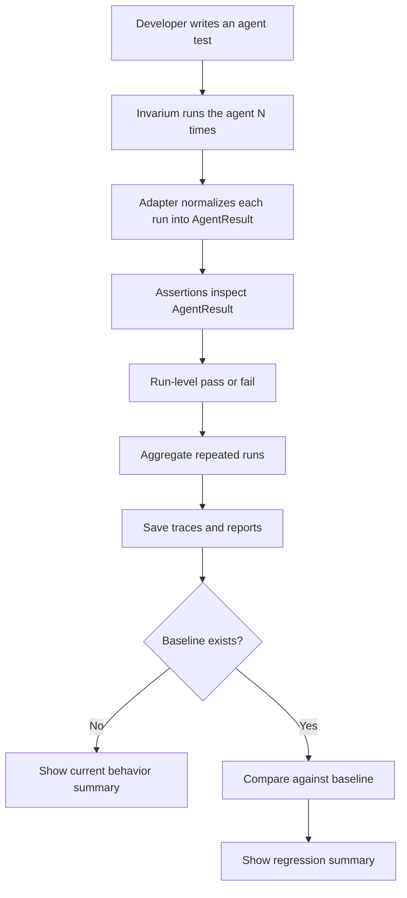

# Invarium Technical Guide

This guide explains how Invarium works, how to write tests with it, and how to extend it.

Project links:

- GitHub: `https://github.com/invarium-ai/invarium/`
- PyPI: `https://pypi.org/project/invarium/`

## Who This Is For

This document is for developers who want to:

- use Invarium on their own agents
- understand the test model
- understand how assertions work
- understand how adapters normalize traces
- extend Invarium with new adapters or assertions

## Core Idea

Invarium is built around one simple idea:

> An agent should be tested on behavior, not exact text.

That means Invarium focuses on observable things such as:

- tool usage
- tool order
- step count
- errors
- unsupported success claims
- regression against a known-good baseline

## Mental Model

An Invarium run has these layers:

1. A test function defines the expected behavior.
2. The agent executes one or more times.
3. Each run is normalized into an `AgentResult`.
4. Assertions inspect the `AgentResult`.
5. Invarium aggregates results across repeated runs.
6. Reports and traces are written locally.
7. Current results can be compared against a baseline.

## End-to-End Flow



## Installation

Current published package:

```bash
pip install invarium
```

Optional framework extras:

```bash
pip install "invarium[langgraph]"
pip install "invarium[openai]"
```

Import name:

```python
import invarium
```

CLI:

```bash
invarium test examples
```

## Basic Usage

### Plain Python Agent Example

```python
from invarium import agent_test, expect


class MyAgent:
    def run(self, prompt: str):
        ...


def build_agent():
    return MyAgent()


@agent_test(runs=5, agent_factory=build_agent)
def test_my_agent(agent: MyAgent):
    result = agent.run("Book a table for 2 tonight")

    check = expect(result, collect=True)
    check.used_tool("restaurant_search")
    check.used_tool("create_booking")
    check.steps_less_than(8)
    check.did_not_claim_confirmation_without_tool("create_booking")
    check.verify()
    return result
```

Run it:

```bash
python -m invarium.cli test .
```

## Test Model

### `@agent_test(...)`

Tests are defined with the `@agent_test(...)` decorator.

Supported parameters today:

- `runs`
  Number of repeated runs for the same test
- `agent_factory`
  Callable that returns a fresh agent instance for each run

Example:

```python
@agent_test(runs=10, agent_factory=build_agent)
def test_booking_agent(agent):
    ...
```

### Why `runs` Matters

Agents are often nondeterministic.

A single successful run may not mean the behavior is reliable.

Repeated runs help answer:

- is the agent flaky?
- does it sometimes skip a required tool?
- did a change reduce success rate?

## `AgentResult`

Every run is normalized into an `AgentResult`.

That is the core object that assertions inspect.

Current conceptual shape:

```python
AgentResult(
    input: str,
    final_output: str,
    messages: list[dict],
    tool_calls: list[ToolCall],
    steps: int,
    errors: list[str],
    latency: float | None,
    cost: float | None,
    metadata: dict,
)
```

### What Each Field Means

- `input`
  The user prompt or input that triggered the run
- `final_output`
  The final answer returned by the agent
- `messages`
  Normalized message-like items observed during execution
- `tool_calls`
  Normalized tool invocations
- `steps`
  A logical measure of how many agent steps occurred
- `errors`
  Any run-level or tool-level errors
- `latency`
  Optional runtime latency
- `cost`
  Optional cost metadata
- `metadata`
  Adapter-specific or run-specific extra data

## `ToolCall`

Tool usage is represented as normalized `ToolCall` objects.

Conceptually:

```python
ToolCall(
    name: str,
    args: dict,
    output: str | dict | None,
    success: bool,
    timestamp: str,
)
```

This normalization is what allows the same assertions to work across different agent frameworks.

## Assertions

Assertions are written against `AgentResult` via `expect(result)`.

### Fail-Fast Mode

Fail-fast mode raises on the first failed assertion.

```python
expect(result).used_tool("search_tool")
```

Use this when you want the shortest possible test style.

### Collected Mode

Collected mode records multiple assertion outcomes before failing.

```python
check = expect(result, collect=True)
check.used_tool("search_tool")
check.used_tool("booking_tool")
check.did_not_error()
check.verify()
```

Use this when you want richer failure summaries from a single run.

### Current Built-In Assertions

#### `used_tool(tool_name)`

Passes if the named tool appears in `result.tool_calls`.

Use it for:

- required tool usage
- validating tool selection

#### `used_tool_times(tool_name, count)`

Passes if the tool was used exactly `count` times.

Use it for:

- exact tool-call count contracts
- workflows where duplicate calls are undesirable

#### `used_tool_at_least(tool_name, count)`

Passes if the tool was used at least `count` times.

Use it for:

- retries
- repeated search or fetch workflows

#### `used_tool_at_most(tool_name, count)`

Passes if the tool was used at most `count` times.

Use it for:

- preventing runaway tool loops
- bounding duplicate behavior

#### `did_not_use_tool(tool_name)`

Passes if the named tool does not appear in `result.tool_calls`.

Use it for:

- preventing unsafe actions
- ensuring a tool is avoided in a given scenario

#### `used_tools_in_order(tool_names)`

Passes if the listed tools appear in the expected sequence.

Use it for:

- multi-step workflows
- enforcing search-then-action patterns

#### `steps_less_than(limit)`

Passes if `result.steps < limit`.

Use it for:

- bounding run complexity
- catching runaway loops

#### `finished_successfully()`

Passes if there are no errors and the final output is non-empty.

Use it for:

- general success checks

#### `did_not_error()`

Passes if `result.errors` is empty.

Use it for:

- direct no-error validation

#### `final_output_contains(text)`

Passes if the final output includes the given text.

Use it when:

- a specific concept or phrase must be present

Keep this lightweight. Invarium is not meant to become an exact string comparison framework.

#### `final_output_does_not_contain(text)`

Passes if the final output does not include the given text.

Use it for:

- blocking unsafe phrases
- avoiding unsupported claims

#### `did_not_claim_confirmation_without_tool(required_tool=None)`

Passes unless the final output makes a success claim without supporting tool evidence.

Use it for:

- bookings
- refunds
- confirmations
- any action where the agent should not claim completion without proof

If `required_tool` is provided, Invarium looks for that tool specifically.

Example:

```python
check.did_not_claim_confirmation_without_tool("create_booking")
```

## Assertion Examples

### Tool Usage Contract

```python
check = expect(result, collect=True)
check.used_tool("search_docs")
check.used_tool("summarize_notes")
check.used_tools_in_order(["search_docs", "summarize_notes"])
check.verify()
```

### Safety Contract

```python
check = expect(result, collect=True)
check.did_not_use_tool("refund_execute")
check.did_not_claim_confirmation_without_tool("refund_execute")
check.verify()
```

### Efficiency Contract

```python
check = expect(result, collect=True)
check.steps_less_than(8)
check.did_not_error()
check.verify()
```

## Running Tests

### CLI

Invarium currently exposes:

```bash
python -m invarium.cli test <path>
python -m invarium.cli bless <path>
python -m invarium.cli compare
python -m invarium.cli report
```

### `test`

Runs discovered Invarium tests.

Example:

```bash
python -m invarium.cli test examples
```

### `bless`

Stores the current results as the baseline.

Example:

```bash
python -m invarium.cli bless examples
```

### `compare`

Compares the latest report to the saved baseline.

Example:

```bash
python -m invarium.cli compare
```

### `report`

Prints the latest saved report summary.

Example:

```bash
python -m invarium.cli report
```

In addition to console output, Invarium now writes:

- `.invarium/reports/latest.json`
- `.invarium/reports/latest.md`

## Baselines and Regression Detection

Invarium stores local run artifacts under:

```text
.invarium/
  baselines/
  traces/
  reports/
```

Each blessed suite is stored as its own JSON file under `.invarium/baselines/`.

Typical workflow:

1. Run a healthy version.
2. Bless it as baseline.
3. Change prompt, tools, orchestration, or model.
4. Rerun tests.
5. Compare against baseline.

Example:

```bash
python -m invarium.cli bless integration_examples
python -m invarium.cli test integration_examples --fail-on-regression
```

What regression currently means:

- success rate dropped compared with the baseline for the same test name

Invarium also guards against unrelated suites. If the current suite and saved
baseline suite do not match exactly, it warns about the mismatch instead of
pretending the comparison is valid. For older baseline files without suite
metadata, it falls back to matching test names.

## Smoke Testing

For a quick post-install check:

```bash
python scripts/smoke_test.py
```

To include live OpenAI tests:

```bash
python scripts/smoke_test.py --with-live
```

The smoke test currently validates:

- package import
- CLI availability
- unit tests if `pytest` is installed
- passing demo behavior
- regression demo expected failure
- live OpenAI integration if `OPENAI_API_KEY` is present

## Pytest Integration

Invarium tests can also run through `pytest`.

Examples:

```bash
python -m pytest tests -q
python -m pytest examples -q
python -m pytest integration_examples -q
```

How it works:

- decorated `@agent_test(...)` functions are collected by the Invarium pytest plugin
- pytest does not run them as normal fixture-based test functions
- each collected test still executes through Invarium's repeated-run logic

## CI Output

Invarium already writes JSON and Markdown artifacts under `.invarium/reports/`.

In GitHub Actions, if `GITHUB_STEP_SUMMARY` is available, Invarium also writes
the Markdown report to the step summary automatically.

## Adapters

Adapters convert framework-specific runtime outputs into `AgentResult`.

Current adapters:

- plain Python adapter
- OpenAI Agents SDK adapter
- LangGraph adapter

### Why Adapters Matter

Every framework exposes traces differently.

Without normalization, assertions would need to be framework-specific.

With adapters, the test-writing experience stays stable.

## Plain Python Adapter

Use this when your agent already returns:

- an `AgentResult`
- or a dictionary that can be converted into one

This is the simplest path for custom Python agents.

## OpenAI Agents SDK Adapter

Use `OpenAIAgentsAdapter` when testing OpenAI Agents SDK agents.

It currently:

- executes the agent through the SDK
- inspects SDK run items
- normalizes tool calls, outputs, and messages
- merges tool call outputs back into logical tool-call records

For real setup details, use:

- [REAL_WORLD_TESTING.md](REAL_WORLD_TESTING.md)
- [ADAPTER_GUIDE.md](ADAPTER_GUIDE.md)

## LangGraph Adapter

Use `LangGraphAdapter` when testing LangGraph or LangChain agents that expose the
common `invoke({"messages": [...]})` interface.

It currently:

- invokes the graph with a user message payload
- reads returned `messages` state
- extracts tool calls from `AIMessage.tool_calls`
- merges tool outputs from `ToolMessage.tool_call_id`
- normalizes logical steps without counting the user input as a behavior step

Pattern:

```python
from invarium import LangGraphAdapter, agent_test, expect

adapter = LangGraphAdapter()


@agent_test(runs=3, agent_factory=build_graph)
def test_langgraph_agent(graph):
    result = adapter.run(graph, "What does Invarium do?")

    check = expect(result, collect=True)
    check.used_tool("search_docs")
    check.used_tools_in_order(["search_docs"])
    check.final_output_contains("Invarium")
    check.did_not_error()
    check.verify()
    return result
```

## Writing a Real OpenAI Agent Test

Pattern:

```python
from invarium import OpenAIAgentsAdapter, agent_test, expect

adapter = OpenAIAgentsAdapter()


@agent_test(runs=3, agent_factory=build_agent)
def test_weather_agent(agent):
    result = adapter.run(agent, "What's the weather in Paris?")

    check = expect(result, collect=True)
    check.used_tool("get_weather")
    check.did_not_error()
    check.verify()
    return result
```

## Extension Points

### Adding a New Assertion

To add a new assertion:

1. implement a new method on the expectation object
2. have it produce an assertion record
3. support both fail-fast and collected behavior
4. add tests for pass and fail cases

Good new assertions are:

- reusable across many agent types
- observable from normalized traces
- easy to explain

Examples of good future assertions:

- exact tool-call count
- clarification behavior
- simple privacy or forbidden-string checks

### Adding a New Adapter

To add a new adapter:

1. identify how the framework exposes:
   - tool calls
   - messages
   - outputs
   - errors
   - step-like units
2. normalize those into `AgentResult`
3. preserve framework-specific extras in `metadata`
4. add adapter-level tests with realistic sample outputs

Good adapter design principles:

- prefer stable normalized fields
- avoid framework leakage into assertions
- keep adapter-specific quirks inside the adapter

For a more concrete adapter contract and contributor template, use:

- [ADAPTER_GUIDE.md](ADAPTER_GUIDE.md)

## Current Limitations

Current limitations include:

- CrewAI adapter is not implemented yet
- regression comparison is still simple
- report generation is still intentionally lightweight
- live tests depend on the local API key and environment setup

## Recommended Adoption Path

If you are integrating Invarium into a real project, the safest path is:

1. start with one small agent test
2. test one high-signal behavior contract
3. run it repeatedly
4. bless a baseline
5. put it in CI
6. expand gradually

Start narrow.
Do not try to test every behavior on day one.

## Summary

The best way to think about Invarium is:

- not as an answer scorer
- not as an observability dashboard
- but as a small behavioral contract layer for agents

You define what correct behavior means.
Invarium helps you run it repeatedly, record it, and catch regressions before production.
